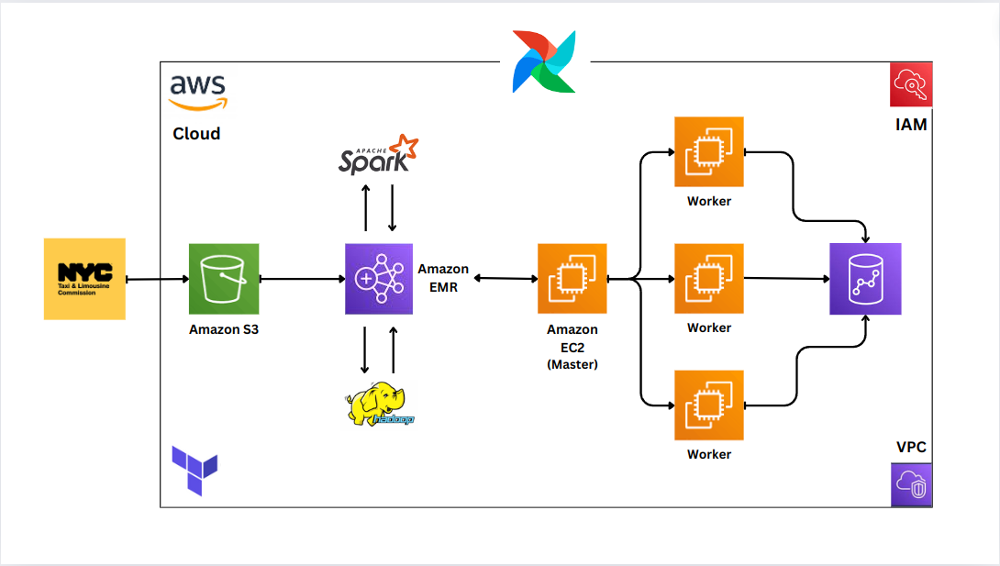

# 👷 Spark-Processing-AWS
In this project, I set up and build a big data processing pipeline using Apache Spark integrated with various AWS services, including S3, EMR, EC2, VPC, IAM, and Redshift and Terraform to setup the infrastructure

## 🔦 About Project

## 📦 Technologies
 - `S3`
 - `EMR`
 - `EC2`
 - `Airflow`
 - `Redshift`
 - `Terraform`
 - `Spark`
 - `VPC`
 - `IAM`

## 🦄 Features
## 👩🏽‍🍳 The Process
## 📚 What I Learned
## 💭 How can it be improved?
## 🚦 Running the Project
